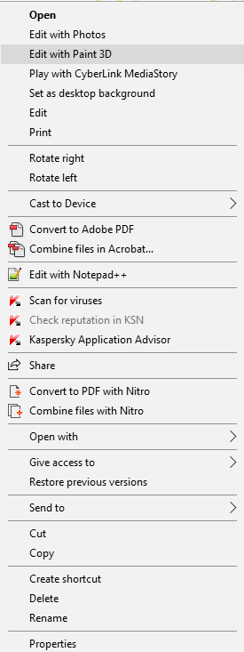
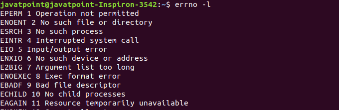

# Welcome to my Github account

+ This file is created by .md which is a language quickly display HTML in github. [Repo to learn](https://docs.github.com/en/get-started/writing-on-github/getting-started-with-writing-and-formatting-on-github/basic-writing-and-formatting-syntax) or [of microsoft](https://learn.microsoft.com/en-us/azure/devops/project/wiki/markdown-guidance?view=azure-devops)
> Vietnamese mode is in [here](overview_vi.md)

- In this overview, i will show all my desktop which I'm using to code
___
## OS (Operating System)
1. Ubuntu
-   [What is Ubuntu?](https://www.google.com/search?channel=fs&client=ubuntu&q=what+is+ubuntu)

___
-  Why is Ubuntu?
> 1. It's light-weight
> 2. It's open-source and free
> 3. It's used for server programing and management
- Below is OSs which Apache (a open-source and popular server management software) using 

> 4. It has a fabulous package management / [apt](https://www.google.com/search?channel=fs&client=ubuntu&q=what+is+apt)
-> Ubuntu is perfect to learning and running server
____
2. Window 10
- No ask what it is, just ask why it not become my main OS
> 1. So heavy and much excessive function  

> 2. Hard to fix system error  

- Why it not notify the error for user like Linux?

> Although I decried Windows a lot, the fact that Window is do some work better than Linux
> - Popular and friendly for beginner
> - Security
> - Microsoft become supporting for devs and open-source environment
___
### Conclustion
#### I think "Window is good for working and longtime coding, and Linux is accordant for learning and level bigger"

## Software
1. Chrome & Firefox
- Every web browser just need to do its main role. 
>   - I surf the Net, I need good UX, security and multi-task experience better  --> Chrome
>   - I code some web. I need DevTools support better, open-source and more "anti-advertistment"   --> Firefox
2. Visual Code
- It's free, multi-language support and good AI suggesting
> My setup VS code  
> **Extension**
> - For language : 
>     - C/C++ pack (VScode suggest)
>     - Java (by VScode suggest + [Generator](https://marketplace.visualstudio.com/items?itemName=sohibe.java-generate-setters-getters))
>     - [Auto-rename tags](https://marketplace.visualstudio.com/items?itemName=formulahendry.auto-rename-tag)
>     - [Live-server](https://marketplace.visualstudio.com/items?itemName=ritwickdey.LiveServer)
> - For ultility : 
>       - [vscode-pdf](https://marketplace.visualstudio.com/items?itemName=tomoki1207.pdf)  
>       - [MySQL](https://marketplace.visualstudio.com/items?itemName=cweijan.vscode-mysql-client2) 
>       - [Better Comment](https://marketplace.visualstudio.com/items?itemName=aaron-bond.better-comments) 
>       - [Intelligen AI](https://marketplace.visualstudio.com/items?itemName=VisualStudioExptTeam.vscodeintellicode) 
>       -[Snipped](https://marketplace.visualstudio.com/items?itemName=JeffersonLicet.snipped)

3. Postman
- Test API
4. K-touch
- "Typing Master" in Linux
___
## Enviroment
1. C++
- Install g++ via terminal `$ sudo apt install -y g++`
2. Java
- Set up JRE, JDK via `sudo apt-get install open-jdk open-jre`
3. MySQL
- `sudo apt install mysql-server`
4. Python
- It's ifinite located in Unix-system.
- Check via `python3 --version`
5. Node
- Run code Javascript like backend programming
- Download from `sudo apt update && sudo apt install -y node`
___
## Conclusion
> All above lines is my desktop setting and I shared it here. I know that I skipped many things, and not understand enough to every I wrote in this post. But, I spend time for here, so please feedback and contact to [me](https://facebook.com/duyhelloworld/)!
<h4 style="text-align: center">**Every small support of you will contribute to a better Vietnamese dev community**<h4>
